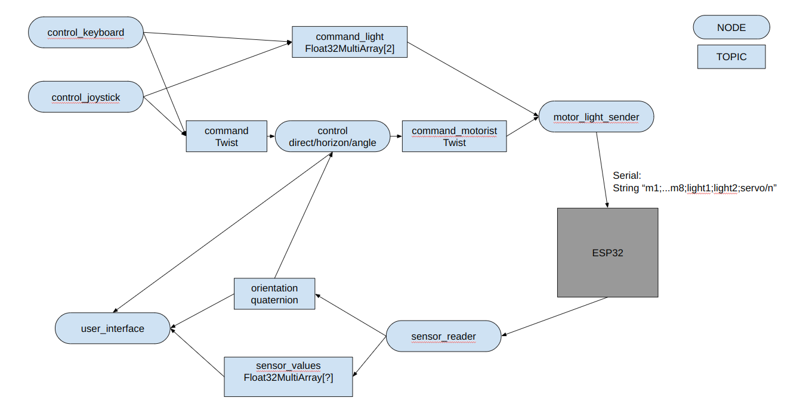

## ---use git---

use the token as the password for identification when pull
to retrieve changes from the remote repository
git fetch

to add new folders
git add .

to update the modification done to the local git folder
git commit -b "comment"

to apply the modification of the last commit to the remote github branch_ros, use as a pwr the token
git push origin branch_ros


## Using ROS2 Humble Version and Python3

Check the drawing on Google Drive:


### SENSOR
- The node `sensor_reader` sends the sensor values to the topic `sensor_values`.
- The node `sensor_display` displays the sensor values from the topic `sensor_values`.
- The topic `sensor_values` is a message of the type `Float32MultiArray` (pressure, tension, etc.).
- The ESP32 sends via the serial a string with floats separated by `;` ending with `/n`.
- The node `user_interface` creates a tkinter interface that displays the sensor data and motor positions.

### Motor and Light
- The node `motor_light_sender` sends the commands to the ESP32 from the topic `command_motor`.
- The ESP32 reads 11 floats that represent the commands for motor1 to motor8 (ranging from -1 to 1) and the states for light_floor and light_front (ranging from 0 to 1) and servo (-1 to 1).
- The topic `command_motor` is a msg of the type `Twist` (3 translations + 3 rotations of the ROV). This topic is general, any node can send a Twist to this topic that will be transformed into motor commands by the node `motor_light_sender`.
- The node `control_keyboard` takes keyboard input and sends a twist to the topic `command_motor`.
- The node `control_joystick` takes input from a PS4 controller to publish a twist to the topic `command_motor`.

For controlling the light:
- The `control_*` node sends a `Float32MultiArray[2]` to the topic `control_light` read by the node `motor_light_sender`.

### Stabilization
- Between the `control_*` node and the topic `command_motor`, we can add a stabilization control.
- The orientation of the ROV is represented by a quaternion called `q`.
- A target orientation called `q_target` is set for the control.
- The node `control_PID` takes the `q_target` and `q` in order to apply a command to the node `motor_light_sender` to reach the orientation `q`. This node takes as input a `Twist` command (from the keyboard or the joystick) and publishes a twist command.

We can have 3 types of control like in betaflight:
- Direct mode: no stabilization, forward the command to the `command_motor`.
- Angle mode: the rate of rotation of `q_target` is proportional to the joystick command.
- Horizon mode: the angle of `q_target` is proportional to the joystick command, when the joystick is released, the ROV returns to a horizontal orientation.

A parameter is needed to set the type of stabilization of the node `control_PID`.

Need to add a deadband for the motor control?

### MOTOR
- The node `motor_light_sender` sends the commands from the topic `motor_commands` to the ESP32.
- The ESP32 reads 11 floats that represent the commands for motor1 to motor8 (ranging from -1 to 1) and the states for light_floor and light_front (ranging from 0 to 1) and servo (-1 to 1).
- The topic `motor_commands` is a msg of the type `Twist` (3 translations + 3 rotations of the ROV).
- You can send commands via the node `motor_control_keyboard`.

### ESP32
- Baudrate is 115200.
- It sends sensor values every 50ms via the serial, a string with floats separated by `;` ending with `/n`.
- Format: "pressure (atm);tension (V);current (mA);t_ext (°C),t_bat;t_esc;leak (0-1);q0;q1;q2;q3;d_sonar(m)/n".
- Reads motor command all the time (if no receive >1s turn off the motors).
- On the screen display alternately the motor commands and the sensor values.

Need to add a function `check_errors()` that needs to be called at each loop iteration.
Types of errors:
- Voltage < VOLTAGE_LOW: flash the light and turn off the motors?
- Time last data received > 1s: motor command to 0, display a message.

### MOTOR MAPPING
```
   ^
   x
<--y z is up

M1           M2
    M5  M6
    M8  M7
M4           M3
```

### MOTOR DIRECTION
```
CCW          CW
    CCW  CW
    CW   CCW 
CW           CCW
```